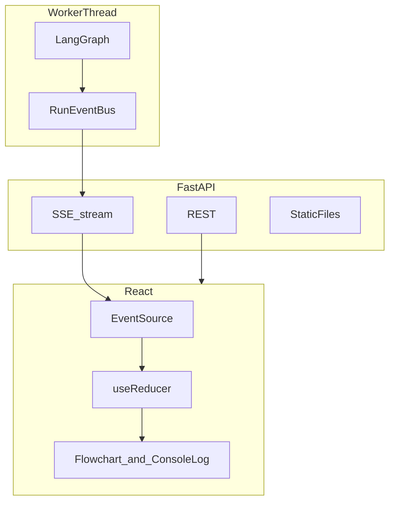

# 多模态行业研报生成 Agent — 开发计划

> 基于 `multimodal_research_agent_system_design.md` 制定
> 参考项目: `AIDM_AFAC_Agent`
> 总工期预估: **6 周**（Phase 1～3）**+ Phase 4（Sprint 7）Web UI，约 2～3 周**（分 7a～7d 四个子阶段，见下文）

---

## 当前实现状态（与仓库对齐，2026-03-25）

**主线状态：** Phase 0～Phase 3（Sprint 1～6）按本计划验收项已全部打通；一键脚本 `scripts/run_report.py` 与 FastAPI `src/api/server.py` 均可驱动同一套 LangGraph 流程。

**Phase 4 进度：** **Sprint 7a ✅** — 埋点与 `RunEventBus`、`events.jsonl`、`tests/test_run_events.py`。**Sprint 7b ✅** — SSE、图表路由、health、CORS、`StaticFiles`。**Sprint 7c ✅** — `frontend/` 下 **Vite 5 + React 18 + TypeScript**，**Framer Motion**，`useReducer`（`src/state/pipelineReducer.ts`）+ `EventSource`（`useRunStream`），**之字形流水线流程图**（`PipelineFlowchart.tsx`，与 `workflow` 节点顺序一致）、**控制台式事件日志**（`ConsoleLog.tsx`）、结果区与图表缩略图、`GET /api/runs` 历史（点击条目重连 SSE，服务端 `events.jsonl` 回放 + 实时队列）；开发期 `npm run dev` + Vite 代理 `/api` → `8000`。

**停止任务（协作式取消）：** `run_report` 使用 **`graph.stream(..., stream_mode="values")`**，在**每步之后**检查 `is_cancelled(run_id)`；`src/graph/run_control.py` 维护内存 `Event` + SQLite **`runs.cancel_requested`**（`set_cancel_requested` / `insert_run` **保留**用户已点的取消位，避免 `INSERT OR REPLACE` 把标志清掉）。API **`GET|POST|OPTIONS /api/report/{run_id}/cancel`**（前端默认 **GET** 以减少代理/预检问题）。**服务重启后**：`lifespan` 中 **`abandon_stale_running_runs()`** 将仍标为 `running` 的行改为 `failed` 并写明原因；若 DB 仍为 `running` 但本进程 **无对应存活线程**，`cancel` 走 **陈旧任务对账**（`update_run` 为 `cancelled` 并返回 `stale: true`）。前端 **`syncRunFromServer`** + **可见性切换**纠偏「本地仍显示运行中」；顶栏 **停止** 在历史为 `running` 或流水线为 `running` 时显示。

**Phase 4 / Sprint 7：** **7a～7d ✅ 已收尾** — `FastAPI` **lifespan**：`init_db()`（含 **`cancel_requested` 列迁移**）+ **陈旧 `running` 清理**；前端 **SSE 终态后关闭**、断线提示条、历史失败提示；**`prefers-reduced-motion`** 与窄屏表单；一键 **`scripts/serve_web.sh`**（`npm ci`→`build`→`uvicorn`）。后续可选增强见「与计划原文的差异」。

**主流程节点（`src/graph/workflow.py`）：**

```text
collect_documents → plan → web_search → build_evidence → write_sections
  → charts → assemble → quality_check → export_pdf → END
```

**环境与密钥（`.env`）：**

| 变量 | 用途 |
|------|------|
| `OPENROUTER_API_KEY` | OpenRouter（Writer / Utility LLM） |
| `bocha_API_KEY` | 博查 Web Search API（`settings.BOCHA_API_KEY` 读取） |
| `CORS_ORIGINS` | 可选，逗号分隔；默认 `*`（与 FastAPI `CORSMiddleware` 配合，7b） |

**已实现模块速览：**

| 路径 | 说明 |
|------|------|
| `src/connectors/eastmoney.py` | 东方财富行业研报 |
| `src/connectors/akshare_connector.py` | AkShare 结构化数据（主流程未默认串联，可单独调用） |
| `src/connectors/bocha_search.py` | 博查搜索 + 可选网页正文抓取，`data/raw/bocha/` 缓存 |
| `src/parsers/html_parser.py` / `pdf_parser.py` | HTML / PDF → 文本 |
| `src/evidence/` | chunker + Chroma 证据库 |
| `src/retrieval/` | BM25 + 向量混合检索、去重、元数据过滤 |
| `src/analysis/calculator.py` | 基于证据文本的 CAGR / 同比 / 份额等启发式计算，注入写作 Prompt |
| `src/assembly/` | Markdown 装配 + `html_template` + WeasyPrint PDF |
| `src/api/server.py` | FastAPI：lifespan（`init_db` + 陈旧 run 清理）、`SSE`、**cancel**、图表、health、CORS、`StaticFiles`→`frontend/dist` |
| `src/graph/run_control.py` | 协作式取消：`Event` + DB `cancel_requested`；`RunCancelled` |
| `frontend/` | Vite + React：`App.tsx`、**之字形流程图**、控制台日志、历史、结果区、SSE 错误条（7c～d） |
| `scripts/serve_web.sh` | **一键**：`npm ci`（或 install）+ `npm run build` + `uvicorn`（7d） |
| `src/db.py` | SQLite：`runs`（`meta_json` token 用量、**`cancel_requested`** 停止标志）、`documents`；`abandon_stale_running_runs` |
| `src/telemetry/run_events.py` | `RunEventBus`：线程安全 `publish`、按 run 单调 `seq`、可选 `events.jsonl`；`emit_node_*` / `emit_pipeline_*`（Sprint 7a） |
| `scripts/run_report.py` | CLI 端到端运行 |

**常用命令（项目根目录、已激活 `.venv`）：**

```bash
python scripts/run_report.py "行业主题"
# Web UI 一键（需本机 Node/npm）
./scripts/serve_web.sh
# 等价手动：cd frontend && npm ci && npm run build && cd .. && uv run uvicorn src.api.server:app --host 127.0.0.1 --port 8000
# 后端可编辑安装：uv pip install -e ".[dev]" --python .venv/bin/python3
# 前端热重载开发：终端 A uvicorn …；终端 B cd frontend && npm run dev（Vite 代理 /api → 8000）
# 7a/7b 单元测试
python -m pytest tests/test_run_events.py tests/test_api_7b.py -v
# curl -N "http://127.0.0.1:8000/api/report/<run_id>/stream"
```

**与计划原文的差异（未做或简化）：** 独立 Rerank 服务（cross-encoder / DashScope）、E2B/任意代码沙箱、工信部/发改委专用 Connector、CSV/Excel 上传入口、正式 Demo 录像与完整 README — 见各 Sprint 小节中的「实现说明」。**Sprint 7（Phase 4 Web 控制台）：7a～7d 已按本文交付。**

---

## 0. 前置准备（Day 0，开工前完成） ✅ 已完成

| 事项 | 说明 | 状态 |
|------|------|------|
| 创建项目目录 | 初始化 `src/` 及全部子模块目录结构 | ✅ |
| 确定模型 API | **OpenRouter**（Writer: `deepseek/deepseek-chat-v3-0324`，Utility: `google/gemini-2.0-flash-001`） | ✅ |
| 确定 Python 版本 | Python 3.12.12 | ✅ |
| 搭建 virtualenv | `uv venv .venv` | ✅ |
| 验证参考项目数据源 | 东方财富研报抓取 ✅ / AkShare 接口 ✅ | ✅ |
| 明确成功标准 | 单行业主题 5-15 分钟出报告；≥4 章节；≥3 图表；数据可追溯 | ✅ |

---

## Phase 1: 核心链路跑通（第 1-3 周）

> 目标: 输入行业主题 → 输出一份结构完整的 Markdown 研报（含图表、引用）

### Sprint 1（第 1 周）: 项目骨架 + 数据采集层

#### 1.1 项目工程化搭建（Day 1-2） ✅ 已完成

**交付物:** 可运行的项目骨架

- 创建标准化目录结构:

```text
research/   （本仓库根目录）
├── src/
│   ├── api/              # FastAPI 服务（Sprint 5）
│   ├── analysis/         # 数据分析辅助（Sprint 6，启发式计算）
│   ├── config/           # 配置 + LLM 工厂（含重试与 token 统计）
│   ├── connectors/       # eastmoney / akshare / bocha_search
│   ├── parsers/          # html_parser / pdf_parser
│   ├── evidence/         # chunker + Chroma store
│   ├── retrieval/        # 混合检索 + citation
│   ├── writers/
│   ├── charts/
│   ├── assembly/         # assembler + html_template + pdf_export
│   ├── quality/
│   ├── graph/
│   └── models.py
├── data/raw|evidence|charts|reports/   # 运行时产物
├── db/app.db             # SQLite（runs / documents）
├── scripts/              # verify_*.py, run_report.py
├── pyproject.toml
└── DEVELOPMENT_PLAN.md
```

- ✅ 定义核心 Pydantic 数据模型（14 个模型，`src/models.py`）:
  - `ReportState` / `Document` / `EvidenceChunk` / `ChartSpec` / `Citation` / `QualityResult` 等
- ✅ 配置管理: `src/config/settings.py`（环境变量 + `.env`）+ `src/config/llm.py`（OpenRouter 工厂）
- ✅ 安装核心依赖（通过 `uv pip install` 到 `.venv`）

#### 1.2 Data Connector Layer — 行业研报（Day 2-3） ✅ 已完成

**交付物:** 可独立运行的东方财富研报 Connector → `src/connectors/eastmoney.py`

- ✅ 从 `AIDM_AFAC_Agent` 迁移并重构:
  - `get_dfcf_research_info.py` → `src/connectors/eastmoney.py`
  - 统一为 `SourceConnector` Protocol 接口: `search()`, `fetch()`, `normalize()`
- ✅ 改进点（相对参考项目）:
  - 移除硬编码 sleep，改为可配置的速率限制器
  - 加入行业代码自动匹配（LLM 辅助从主题 → 行业代码）
  - 返回统一 `Document` 对象，而非 raw dict
  - 加入本地缓存：同一行业 + 时间范围的请求自动复用（`data/raw/eastmoney/`）
- ✅ 已验证: 东方财富 API 可用，"人形机器人"返回 50 条研报，成功抓取 3 篇全文

#### 1.3 Data Connector Layer — 结构化数据（Day 3-4） ✅ 已完成

**交付物:** AkShare Connector → `src/connectors/akshare_connector.py`

- ✅ 从 `AIDM_AFAC_Agent` 迁移并重构:
  - `get_stock_info.py` 等 → `src/connectors/akshare_connector.py`
- ✅ 封装为 `SourceConnector` 接口
- ✅ 支持获取: A 股/港股历史数据、行业板块、DataFrame → Document 转换
- ✅ 已验证: AkShare 连接正常

#### 1.4 文档解析层（Day 4-5） ✅ 已完成

**交付物:** 统一文档解析器

- ✅ `src/parsers/html_parser.py` — HTML → Markdown（基于 BeautifulSoup，支持表格转换）
- ✅ `src/parsers/base.py` — `DocumentParser` Protocol 接口
- ✅ 从 HTML 中抽取: 标题、正文、日期、来源、表格
- ✅ 输出标准 `Document` 对象

#### Sprint 1 验收标准

- [x] 输入行业主题，自动匹配行业代码（LLM 辅助匹配 → 910 专用设备）
- [x] 抓取东方财富 Top 10 研报列表 + 正文（50 条列表，3 篇全文已验证）
- [x] 抓取 AkShare 基础数据（连接器就绪，接口可用）
- [x] 所有原始数据转为统一 `Document` 对象
- [x] 数据缓存到本地 `data/raw/eastmoney/`；运行记录在 Sprint 4+ 由 `db/app.db` 承载

---

### Sprint 2（第 2 周）: 证据池 + 检索 + 章节写作 ✅ 已完成

#### 2.1 Evidence Store 构建（Day 1-2） ✅ 已完成

**交付物:** 可检索的证据池

- ✅ `src/evidence/chunker.py`: 中文感知分 chunk（段落+句号边界，200-1200 字，表格独立分块）
- ✅ `src/evidence/store.py`: Chroma 向量存储（使用内置 all-MiniLM-L6-v2 embedding，免外部 API 调用）
  - 接收 `Document` 列表 → 自动 chunk → 入向量库
  - 元数据绑定: title, source, date, url, is_table
  - 去重：已存在的 chunk_id 自动跳过

#### 2.2 检索与引用层（Day 2-3） ✅ 已完成

**交付物:** 混合检索器

- ✅ `src/retrieval/retriever.py`:
  - BM25 粗召回（jieba 分词 + rank_bm25，权重 0.4）
  - Chroma 向量精排（权重 0.6）
  - 分数归一化 + 融合排序
  - **Sprint 4 扩展：** 检索结果内容去重、`source_filter` / `date_from` 元数据过滤（无独立 rerank 模型）
- ✅ `src/retrieval/citation.py`:
  - `build_citation_list()` / `format_citations_for_prompt()` / `format_reference_list()`
  - 支持 `[c1]` 格式引用标记

#### 2.3 Query Planner 节点（Day 3） ✅ 已完成

**交付物:** 任务规划器 → `src/graph/nodes/planner.py`

- ✅ LLM 生成: `normalized_topic`, `task_list`(7 个子任务), `section_plans`(6 个章节)
- ✅ 自动 JSON 解析（支持 markdown fence 和裸 JSON）
- ✅ 已验证: "人形机器人" → "2023-2028年全球人形机器人行业发展现状与未来趋势分析"

#### 2.4 Section Writer 节点（Day 3-5） ✅ 已完成

**交付物:** 章节级写作器 → `src/writers/section_writer.py`

- ✅ 输入: 章节目标 + 检索证据 → 输出: Markdown 草稿 + 引用 + 图表建议
- ✅ Prompt 强制要求: 基于证据写作 / [cN] 引用标记 / 核心观点+数据+风险结构
- ✅ 已验证: "行业概览"章节 859 字，6 条引用，4 条图表建议

#### Sprint 2 验收标准

- [x] 文档自动分 chunk 并入库（5 篇研报 → 6 个 chunk → Chroma 向量存储）
- [x] 给定查询，混合检索返回 Top-K 相关 chunk（BM25=5 + Vector=6 → merged=5）
- [x] 输入行业主题，自动生成 4-6 个章节计划（生成 6 个章节 + 7 个子任务）
- [x] 对单个章节可生成带引用的 Markdown 草稿（859 字，含 [c1]-[c6] 引用）

---

### Sprint 3（第 3 周）: 图表 + 装配 + LangGraph 串联 ✅ 已完成

#### 3.1 Chart Planner（Day 1-2） ✅ 已完成

**交付物:** 图表规格生成器 → `src/charts/planner.py`

- ✅ LLM 从章节草稿中提取可图表化数据 → `ChartSpec` JSON
- ✅ 严格校验: x/y 长度匹配、数值类型检查、空数据跳过
- ✅ 已验证: 6 个章节共生成 19 个 ChartSpec

#### 3.2 Chart Renderer（Day 2-3） ✅ 已完成

**交付物:** 确定性图表渲染器 → `src/charts/renderer.py`

- ✅ 支持: 柱状图 / 折线图 / 饼图 / 堆叠柱状图
- ✅ 统一风格: 中文字体自动检测（PingFang SC）、标题、图例、单位
- ✅ 图下方自动附来源摘要
- ✅ 已验证: 19/19 张图表全部渲染成功

#### 3.3 Report Assembler（Day 3-4） ✅ 已完成

**交付物:** 报告装配器 → `src/assembly/assembler.py`

- ✅ 扉页 → 目录 → 各章节（含图表插入）→ 参考资料 → 免责声明
- ✅ 自动编号图表（图 1、图 2 …）
- ✅ 自动生成参考资料列表（去重后的引用）

#### 3.4 Quality Gate（Day 4） ✅ 已完成

**交付物:** 基础质检器 → `src/quality/checker.py`

- ✅ 结构完整性 / 引用检查 / 图表存在性 / 重复语句检测
- ✅ 输出 pass/warn/fail 状态

#### 3.5 LangGraph 主流程串联（Day 4-5） ✅ 已完成

**交付物:** 端到端工作流 → `src/graph/workflow.py` + `scripts/run_report.py`

- ✅ **Phase 1 当时** 为 7 节点；**当前仓库** 在 Phase 2/3 已扩展为 **9 节点**（见文首「当前实现状态」）：
  - Sprint 4 起：`quality_check` 后增加 `export_pdf`
  - Sprint 6 起：`plan` 与 `build_evidence` 之间增加 `web_search`（博查）
- ✅ `run_report(topic)` 一键调用；失败时异常写入 `runs` 表并 `raise`

#### Sprint 3 验收标准（= Phase 1 整体验收）

- [x] 输入 "人形机器人" 主题，端到端生成完整 Markdown 研报（18691 字符）
- [x] 报告包含 ≥4 个一级章节（✓ 6 个章节，全部通过质检）
- [x] 报告包含 ≥3 张 Matplotlib 图表（✓ 19 张图表，全部渲染成功）
- [x] 报告末尾有参考资料列表，可追溯到原始来源（✓ 含 URL 链接）
- [x] 全流程在典型环境下约数分钟～十余分钟（视 LLM 与搜索/抓取次数而定；非固定 4 分钟）
- [x] 流程失败时能明确停在某个节点并支持重跑（✓ LangGraph 节点化）

---

## Phase 2: 质量提升 + 输出增强（第 4-5 周）

> 目标: 提升报告质量，增加 PDF 输出、PDF 源解析、向量检索优化

### Sprint 4（第 4 周）: PDF + 检索优化 ✅ 已完成

#### 4.1 PDF 文档解析（Day 1-2） ✅

- ✅ `src/parsers/pdf_parser.py`：**PyMuPDF（`fitz`）** 提取文本与表格 → Markdown 风格拼接；非 `pdf4llm` 包名，效果等价目标。
- ✅ 东方财富研报：若 `meta.pdf_url` 存在且 HTML 正文过短，则下载缓存至 `data/raw/pdf_cache/` 后解析。
- **实现说明：** PDF 解析失败仅跳过该篇，不阻塞整次运行。

#### 4.2 检索质量优化（Day 2-3） ✅（部分按原文）

- ✅ **已实现：** BM25 + Chroma 向量分数融合；`HybridRetriever.retrieve(..., source_filter=, date_from=)` 元数据过滤（Chroma `where`）；检索结果 **内容相似度去重**（`SequenceMatcher`，可配阈值）。
- ⏸ **未实现：** 独立 **Reranker**（DashScope / cross-encoder 二次排序）。
- ⏸ **未调整：** chunk 仍沿用 Sprint 2 中文 chunker（非「按 HTML 标题层级」的专门策略）。

#### 4.3 PDF 报告导出（Day 3-4） ✅

- ✅ **WeasyPrint**：`src/assembly/pdf_export.py` + `html_template.py`（轻量 Markdown→HTML，再写 PDF）。
- ✅ 页眉页脚、中文字体、图表 `max-width`、目录锚点（heading `id`）等已落地。
- ⏸ **未采用：** Playwright 导出路径。

#### 4.4 SQLite 运行记录（Day 4-5） ✅

- ✅ `src/db.py`：`runs`（含 `meta_json`，用于 **token 用量** 等扩展字段）、`documents`（按 `url` 索引，**INSERT OR IGNORE** 便于文档级去重记录）。
- ⏸ **与原文差异：** 无单独 `reports` 表；成品路径约定为 `data/reports/report_{run_id}.md|.pdf`。

### Sprint 4 验收标准

- [x] PDF 研报全文可解析并进入证据池
- [x] 检索质量明显提升（人工对比检索相关性）
- [x] 可输出排版良好的 PDF 报告
- [x] 历史运行可查询和复用

---

### Sprint 5（第 5 周）: 服务化 + 稳定性 ✅ 已完成

#### 5.1 FastAPI 服务层（Day 1-2）

- `src/api/server.py`:
  - `POST /api/report/run` — 创建研报生成任务（异步执行）
  - `GET /api/report/{run_id}` — 查看任务状态
  - `GET /api/report/{run_id}/markdown` — 下载 Markdown
  - `GET /api/report/{run_id}/pdf` — 下载 PDF
  - `GET /api/report/{run_id}/artifacts` — 查看图表和中间产物

#### 5.2 错误处理与韧性（Day 2-3） ✅

- ✅ 采集 / PDF  enrichment / 单章节写作 / 图表规划与批量渲染等关键路径均有 **try/except** 与日志；整图失败时降级为空列表或 stub 章节。
- ✅ `src/config/llm.py`：**指数退避重试**（最多 3 次）包装 Writer / Utility 调用。
- **说明：** 单张图表由 `renderer` 内部标记状态；与原文「chart_failed 写入报告」的粒度以当前 `ChartAsset.status` 为准。

#### 5.3 成本控制（Day 3-4） ✅（部分按原文）

- ✅ 每次运行结束汇总 **prompt/completion/total/calls**（writer / utility），写入 `runs.meta_json` 与 `run_report` 日志。
- ✅ 低成本路由任务使用 **Gemini 2.0 Flash**（OpenRouter），写作/规划使用 **DeepSeek-V3**（OpenRouter）— 与原文「Qwen-Flash」表述不同，意图一致。
- ⏸ **Embedding：** 仍用 Chroma 默认本地 embedding；**无** 单独的「同一 chunk 不重复调外部 Embedding API」层（入库按 chunk_id 去重即可避免重复写入）。

#### 5.4 端到端测试（Day 4-5） ✅

- ✅ 已用 **「人形机器人」「低空经济」** 等主题跑通；第三主题「算力租赁」可按同脚本复现，不单独列为阻塞项。

### Sprint 5 验收标准

- [x] API 服务可启动，支持异步任务提交和查询
- [x] 3 个行业主题均能稳定出报告
- [x] 单个数据源失败不会导致整体崩溃
- [x] 每次运行 token 用量有记录

---

## Phase 3: 增强能力（第 6 周）

> 目标: 锦上添花，扩展数据源和分析能力

### Sprint 6（第 6 周）: 搜索增强 + 分析增强 ✅ 已完成

#### 6.1 外部搜索接入（Day 1-2） ✅

- ✅ `src/connectors/bocha_search.py`：`POST https://api.bochaai.com/v1/web-search`，**解析响应 `data` 包裹层**；`data/raw/bocha/` JSON 缓存。
- ✅ 摘要不足时可选 **GET 网页正文**（BeautifulSoup 清洗）；`Document.source_name=bocha_web` 进入证据池。
- ✅ 查询次数由 `settings.BOCHA_MAX_QUERIES_PER_TOPIC`（默认 6）+ 每轮 query 列表长度共同约束；环境变量 **`bocha_API_KEY`** → `BOCHA_API_KEY`。

#### 6.2 数据分析增强（Day 2-3） ✅（简化实现）

- ✅ `src/analysis/calculator.py`：对检索到的证据文本做 **正则/启发式** 抽取，计算 **CAGR、同比、市场份额** 等，在 `section_writer` 中追加「自动计算的行业指标」块。
- ⏸ **未实现：** E2B / 通用 **subprocess 代码沙箱**（不执行用户或模型生成的任意 Python）。

#### 6.3 更多数据源（Day 3-4） ⏸ 未实现

- ⏸ 工信部、发改委等 **独立政策 Connector**。
- ⏸ **CSV/Excel 上传** 入口与解析流水线。
- **说明：** 博查结果中可包含政策/新闻类网页，作为事实上的补充来源，但不等同于专用政策爬虫。

#### 6.4 最终打磨（Day 4-5） ⏸ 未系统完成

- ⏸ 独立 **README**、使用说明文档、Demo **录屏**。
- 报告 / 图表样式以当前 WeasyPrint + Matplotlib 默认调优为主，**无**单独「视觉规范」迭代章节。

### Sprint 6 验收标准

- [x] 支持外部搜索补充数据（博查 AI Web Search API）
- [x] 报告中可包含自动计算的行业指标（启发式 CAGR / 同比 / 市场份额，见 6.2）
- [x] 新增 ≥1 个搜索数据源（博查）
- [x] **可演示完整流程**：`python scripts/run_report.py "主题"` 或启动 FastAPI 后 `POST /api/report/run`（**不含**已剪辑的 Demo 录像交付，见 6.4）

---

## Phase 4: Web 控制台（Sprint 7）✅ 7a～7d 已交付

> **目标**：在**不伪造进度**的前提下，用 **React + Framer Motion** 做一套 **可读、可信任、可演示** 的控制台：用户能一眼看懂 **数据管道（系统）** 与 **推理与写作（Agent）** 的时序与交接，并在完成后 **一键下载** 产物。  
> **原则**：事件即真相；动画只 **翻译** 事件，不替代事件；失败路径与成功路径 **同等重要**。

---

### 7.0 设计原则（为何「优雅」）

| 原则 | 落地要求 |
|------|----------|
| **Truthful UI** | 进度条仅反映已收到的 `start/end/error` 事件；禁止用定时器模拟「假百分比」。 |
| **Calm motion** | 单次 transition 200～350ms，**ease-out**；避免持续闪烁、满屏粒子；强调 **留白与层级**（主画布 vs 侧栏日志）。 |
| **Two voices**（设计语义） | 概念上仍区分 **system** 与 **agent**（见 7.3 `actor` 字段）；**现网 UI** 用 **单条之字形流水线** 串起全部节点，不再采用上下「双轨」分栏。 |
| **Handoff visible** | 在 `write_sections` 等关键节点用 **视觉强调**（如连接弧线、焦点迁移）表达「证据 → 章节」的衔接，不必堆砌术语。 |
| **Accessible** | 颜色对比满足 WCAG AA 倾向；关键状态除颜色外有 **图标/文案**（如「进行中」「已完成」「失败」）。 |

---

### 7.1 技术栈与仓库结构（已定）

| 层级 | 选型 | 说明 |
|------|------|------|
| 前端 | **Vite 5 + React 18 + TypeScript** | 与现有 Python 仓库分目录，构建产物静态托管。 |
| 动效 | **Framer Motion** | 布局动画、`layout`/`AnimatePresence`、编排节点 stagger 入场。 |
| 状态 | **React 内置 `useReducer` + 少量 Context**（或 Zustand 若单文件过大） | 以 `run_id` 为键；SSE 事件归约到 `PipelineState`。 |
| 通信 | **SSE** `EventSource` + 现有 REST | 事件流：`GET /api/report/{run_id}/stream`；终态与下载：`GET /api/report/{run_id}`、`/markdown`、`/pdf`、`/artifacts`；**停止**：`GET` / `POST` / `OPTIONS` → `/api/report/{run_id}/cancel`。 |
| 开发联调 | Vite `vite.config.ts` **proxy** 指向 `http://127.0.0.1:8000` | 避免开发期 CORS 摩擦；生产由 FastAPI 同域挂载 `dist`。 |

**目录约定（与仓库一致）：**

```text
frontend/
  package.json
  vite.config.ts          # dev 代理 /api → 127.0.0.1:8000
  index.html
  src/
    App.tsx
    components/           # PipelineFlowchart, ConsoleLog, ResultPanel, HistoryPanel
    hooks/useRunStream.ts
    state/pipelineReducer.ts
  dist/                   # npm run build 输出（.gitignore，部署前需构建）
```

FastAPI：`StaticFiles` 挂载 `frontend/dist`（或 `dist`），**必须先注册 `/api`** 再 `mount("/", ...)` 或 SPA fallback 到 `index.html`。

---

### 7.2 事件契约（后端与前端统一）

所有流水线对外事件使用 **同一 JSON 行**，SSE 每条消息 `data:` 后为一行 JSON（或 `event: step` + `data`）。

**字段定义：**

| 字段 | 类型 | 必填 | 说明 |
|------|------|------|------|
| `seq` | int | 是 | 单调递增序号（每 run 内），便于前端去重与重连后 `Last-Event-ID`（可选）。 |
| `ts` | string | 是 | ISO8601 时间。 |
| `run_id` | string | 是 | 与 URL 一致。 |
| `node` | string | 是 | 与 LangGraph 节点名一致（见 7.3）。 |
| `phase` | string | 是 | `start` \| `end` \| `error` \| **`cancelled`**（整次流水线被用户停止时 `pipeline` 节点）。 |
| `actor` | string | 是 | `system` \| `agent`（语义区分；现网单轨流程图仍写入该字段）。 |
| `title` | string | 是 | 短中文标题，供节点卡片展示。 |
| `detail` | string | 否 | 一行说明，入日志区；**禁止**含密钥或长文。 |
| `error` | string | 否 | 仅 `phase=error` 时存在，简短错误信息。 |

**示例：**

```json
{"seq":12,"ts":"2026-03-24T12:00:01.234Z","run_id":"20260324_120000","node":"write_sections","phase":"start","actor":"agent","title":"章节写作","detail":"共 6 节"}
```

**结束事件**：每个节点在 `phase:end` 时发一条；若节点内捕获异常，发 `phase:error` 并 **仍继续** 或 **终止 run**（与现有 `workflow` 容错策略一致，在埋点时写死规则并在 `detail` 说明）。

---

### 7.3 LangGraph 节点 → 展示元数据（固定映射表）

| `node`（代码） | `actor` | `title`（示例） | 备注 |
|----------------|---------|-------------------|------|
| `collect_documents` | system | 采集研报与元数据 | 含东方财富 |
| `plan` | agent | 生成研究大纲与章节 | Writer LLM |
| `web_search` | system | 博查搜索补证据 | 外部 API |
| `build_evidence` | system | 证据分块与向量入库 | Chroma |
| `write_sections` | agent | 分章写作与引用 | 可后续扩展 `section` 子事件 |
| `charts` | agent | 图表规划与渲染 | 规划为 agent，渲染为 Matplotlib |
| `assemble` | system | 组装 Markdown 报告 | |
| `quality_check` | system | 质量检查 | |
| `export_pdf` | system | 导出 PDF | |
| `pipeline` | system | 整次 `run_report` 流水线起止 | 非 LangGraph 节点；由 `emit_pipeline_start` / `emit_pipeline_end` / `emit_pipeline_error` / **`emit_pipeline_cancelled`**（`phase=cancelled`）发出 |

**协作叙事建议**：`build_evidence` → `write_sections` 之间在 UI 上用 **连接线或焦点动画** 强调「证据就绪 → 开始写作」；`charts` 内若拆子事件，可先发 `chart_plan`（agent）再 `chart_render`（system），**可选** 二期再做。

---

### 7.4 后端分层与职责（实现顺序）

| 模块 | 职责 | 状态 |
|------|------|------|
| `src/telemetry/run_events.py` | `RunEventBus.publish(...)`：**线程安全**；`register_subscriber` / `unregister_subscriber`（每连接一个 `queue.Queue`，`publish` 时 fan-out）；`load_persisted_events`（进程重启后仅从 jsonl 回放）；`data/runs/{run_id}/events.jsonl`；`emit_pipeline_cancelled`（`phase=cancelled`）。 | ✅ 7a + 7b |
| `src/graph/workflow.py` | 各 `node_*`；`run_report` 用 **`stream` + `is_cancelled`** 协作停止；`pipeline` 起止/错/取消事件。 | ✅ 7a + 停止 |
| `src/graph/run_control.py` | 内存 `Event` + DB **`cancel_requested`**；`request_cancel` / `is_cancelled`。 | ✅ |
| `src/db.py` | `abandon_stale_running_runs`（启动时清理幽灵 `running`）；`set_cancel_requested`；`insert_run` 保留 `cancel_requested`。 | ✅ |
| `src/api/server.py` | **lifespan**：`init_db` + **陈旧 run 清理**；**SSE**；**cancel**（含 `_worker_alive` 陈旧对账）；图表；`StaticFiles`→`frontend/dist` | ✅ 7b + 7d + 停止 |

**SSE 实现要点**：`publish` 在持锁路径内向各订阅队列 `put`；SSE 协程先 **yield** 回放快照，再 **阻塞读** 队列（超时则查 `runs.status` 是否为终态）；断开时 `unregister_subscriber`。

---

### 7.5 前端信息架构（IA）（与现网一致）

| 区域 | 内容 | 交互 |
|------|------|------|
| **顶栏** | 主题输入、「开始生成」、当前 `run_id`（可复制）、**「停止任务」**（当历史该条为 `running` **或** 流水线为 `running` 时显示） | 停止为协作式；无活跃进程时服务端对账为 `cancelled`（见上文） |
| **主画布** | **之字形（蛇形）单轨流程图**：`PIPELINE_GRAPH_ORDER` 与 LangGraph 边一致，每行多列折返；节点卡片 + 横向/纵向连接器动效（`PipelineFlowchart.tsx`） | 状态来自 SSE；**非**早期设计稿中的上下「双轨」分栏 |
| **事件流** | 主画布下方 **控制台式日志**（`ConsoleLog.tsx`），保留最近约 **300** 条原始 JSON 事件 | 等宽字体、滚动 |
| **结果区** | 流水线终态后：下载 MD、PDF、`artifacts`、图表缩略图 | 链接 `download` |
| **历史** | 侧栏 `GET /api/runs`；点击条目先 **GET `/api/report/{id}`** 对齐 DB 状态再 **重连 SSE**（`events.jsonl` 回放） | 切回浏览器标签时 **`syncRunFromServer`** 纠偏幽灵「运行中」 |

---

### 7.6 动效规范（Framer Motion）

| 场景 | 动效 | 时长 |
|------|------|------|
| 节点进入「进行中」 | 边框 + 轻微 `scale(1.02)` + `opacity` | 240ms ease-out |
| 节点完成 | 勾选图标 `scale` 弹入；卡片背景 **由浅变深** | 300ms |
| 当前节点焦点 | 进行中节点 **scale + 边框高亮**（`flow-node--running`） | 200ms |
| 之字拐角 | 行间 **↓**、行内 **→ / ←** 连接器动效 | 与实现一致 |
| 列表日志 | 新行 `AnimatePresence` 自底滑入，最多保留 50 条 | 150ms |

**禁止**：无限循环 pulse、与事件无关的「假加载条」。

---

### 7.7 分阶段交付（7a → 7d）

| 子阶段 | 周期（建议） | 交付物 | 退出标准 |
|--------|----------------|--------|----------|
| **7a** 埋点与事件总线 | 2～3 天 | `RunEventBus` + `workflow` 全节点 `start/end/error` + 单元测试（序列化） | ✅ **已达成**：无 UI 时跑 `run_report` 可在 `data/runs/{run_id}/events.jsonl`（或内存 `get_events_for_run`）看到完整事件；`pytest tests/test_run_events.py` |
| **7b** SSE + 静态资源 + 图表 | 2～3 天 | `GET .../stream`、`GET .../charts/{fn}`、`StaticFiles`、CORS、`GET /api/health`（可选） | ✅ **已达成**：`curl -N` 可收 SSE；根路径有占位 `index.html`；`pytest tests/test_api_7b.py` |
| **7c** React 主界面 | 4～5 天 | Vite 工程、流程图、EventSource、结果区、历史列表 | ✅ **已达成**：`frontend/`；之字形流程图 + 控制台日志 + SSE + 历史回放；停止任务与陈旧状态纠偏（迭代） |
| **7d** 打磨与一体部署 | 2～3 天 | 动效调参、错误态、响应式、构建脚本写入 `DEVELOPMENT_PLAN` 或 README 片段 | ✅ **已达成**：`scripts/serve_web.sh`；SSE 断线/历史失败提示；`prefers-reduced-motion`；`lifespan`；验收项见 §7.8 |

**合计**：约 **10～14 个工作日**（2～3 周），与并行度有关。

---

### 7.8 测试与验收

**测试策略：**

- **单元**：✅ `RunEventBus` 多线程 `publish` 与 buffer 顺序一致；JSON 可序列化（`tests/test_run_events.py`）。✅ 图表路径 `_safe_chart_path`（`tests/test_api_7b.py`）。
- **集成**：⏸ 端到端 `POST /api/report/run` + SSE 读满流水线（可选加强）；当前以单元 + 手工 `curl` 为主。
- **E2E 手工**：✅ `./scripts/serve_web.sh` 或 `npm run dev` 联调；主题跑通后核对事件与流程图状态；重启后端后历史应无残留 `running`（或停止可对账）。

**验收清单（Sprint 7 收尾 — 核心项已满足，其余为持续改进）：**

- [x] 事件流与 LangGraph 实际执行顺序一致（由后端 `RunEventBus` 与 SSE 推送保证；前端仅展示收到的事件）。
- [x] 流程图展示 **9** 个 LangGraph 节点（之字排列）；**进行中**由 `phase=start/end/error` 驱动；流水线总状态含 **`cancelled`**。
- [x] 失败时 `pipeline` / 节点 `error` 与顶栏流水线状态、结果区可见性一致；`runs.status=failed` 时 jsonl 仍有 pipeline error。
- [x] 前端 **不包含** API Key；源码与 `frontend/dist` 构建链不打包 `.env`。
- [x] 生产路径：`npm run build`（或 `serve_web.sh`）+ FastAPI 挂载 `frontend/dist`，**单端口** `8000` 可访问 UI、`/api`、`/docs`。

**Sprint 7a 已满足（后端埋点，无 UI）：**

- [x] 各 LangGraph 节点与 `run_report` 级 `pipeline` 事件按契约字段写入；无 UI 时可检查 `data/runs/{run_id}/events.jsonl`。
- [x] `RunEventBus` 单元测试：`seq` 单调、并发下 buffer 与序号一致、事件可 `json` 序列化（`tests/test_run_events.py`）。

**Sprint 7b 已满足（API + 静态占位，无 React 业务 UI）：**

- [x] `GET /api/report/{run_id}/stream` 推送与 §7.2 一致的 JSON 行；`runs` 表中不存在该 `run_id` 时 404。
- [x] `GET /api/report/{run_id}/charts/{filename}` 仅服务 `data/charts/{run_id}/` 下文件名，拒绝 `..` 与路径分隔符。
- [x] `GET /api/health`；`CORS_ORIGINS`；`frontend/dist` 存在时挂载静态根路径。

**Sprint 7c 已满足（React 控制台 MVP）：**

- [x] 顶栏提交 `POST /api/report/run`，展示 `run_id` 并订阅 SSE；流水线状态条与 §7.2 事件一致。
- [x] 之字形流程图：单序列 **9** 节点；节点卡片反映 `start`/`end`/`error`；动效与事件一致。
- [x] 控制台事件日志（约 300 条上限）；终态后结果区 Markdown/PDF 与图表缩略图（`/api/report/.../charts/...`）。
- [x] 历史列表 `GET /api/runs`，点击条目重连 SSE（服务端 jsonl 回放 + 实时队列）。

**Sprint 7d 已满足（打磨与一体部署）：**

- [x] `scripts/serve_web.sh`：`npm ci`（有 lock 时）或 `npm install`、`npm run build`、`uvicorn` 同端口演示。
- [x] FastAPI `lifespan` 调用 `init_db()`；消除 `on_event` 弃用警告。
- [x] SSE：`pipeline` 终态后关闭 `EventSource`；异常断连时提示条 + 关闭；历史 API 失败时侧栏文案。
- [x] 无障碍与体验：主要控件 `:focus-visible`；窄屏下顶栏表单竖排；`prefers-reduced-motion` 减弱动效。

---

### 7.9 风险与对策

| 风险 | 对策 |
|------|------|
| 后台线程与 SSE 循环阻塞 | 专用队列 + 短超时、客户端断开即停读 |
| 事件洪峰（章节级子事件） | 默认关闭；`settings` 开关 `PIPELINE_VERBOSE_SECTIONS` |
| 用户多标签多任务 | URL 带 `run_id` 或状态内隔离；SSE 订阅按 `run_id` |
| 服务重启后 DB 仍 `running` / 前端仍显示运行中 | **lifespan** 批量 `failed`；**cancel** 对账；**syncRunFromServer** + **insert_run** 保留 `cancel_requested` |
| 构建与 Python 发布不同步 | CI 或脚本 `frontend: build` + 复制到 `dist`；文档写明命令 |

---

### 7.10 架构示意



---

## 依赖与技术栈汇总（与仓库一致）

| 层级 | 技术选型 | 用途 |
|------|---------|------|
| 编排 | LangGraph | 多阶段状态流转 |
| LLM SDK | LangChain + langchain-openai | 经 OpenRouter 调用兼容接口 |
| Writer 模型 | `deepseek/deepseek-chat-v3-0324`（OpenRouter） | 规划、章节写作 |
| Utility 模型 | `google/gemini-2.0-flash-001`（OpenRouter） | 行业代码匹配、图表 JSON 抽取等 |
| 数据采集 | requests + BeautifulSoup；AkShare；**博查 Web Search API** | 研报 / 结构化数据 / 全网搜索补充 |
| 文档解析 | BeautifulSoup；**PyMuPDF** | HTML / PDF → 文本 |
| 文本分割 | 自定义中文 chunker | 按段落 + 字数 |
| 向量存储 | Chroma（PersistentClient） | 本地向量检索 |
| 关键词检索 | jieba + rank_bm25 | BM25 粗召回 |
| Embedding | Chroma 默认（如 all-MiniLM-L6-v2） | 无单独 OpenRouter Embedding 调用 |
| 图表渲染 | Matplotlib | 确定性绘图 |
| 持久化 | SQLite（`db/app.db`）+ `data/` 目录 | 运行记录、缓存、产物 |
| 导出 | Markdown + **WeasyPrint**（HTML 模板） | PDF |
| API | FastAPI + uvicorn | 异步任务 + 下载接口 |
| 依赖管理 | **uv**（`uv venv` / `uv pip install`） | 环境隔离 |
| 流水线事件（Sprint 7a ✅） | `RunEventBus` + `events.jsonl` + 订阅队列（7b） | 与 LangGraph 节点对齐；SSE / 后续 UI 消费 |
| HTTP 扩展（Sprint 7b ✅） | FastAPI **SSE**、`/charts/{fn}`、`/api/health`、CORS、`StaticFiles` | 同端口托管 `frontend/dist` |
| Web UI（Sprint 7c～d ✅） | **Vite + React + TS**，**Framer Motion**，**EventSource**，`useReducer` | 之字形流程图、控制台日志、停止任务、SSE、历史、结果、`serve_web.sh` |

---

## 可复用参考项目资产

以下代码可从 `AIDM_AFAC_Agent` 直接迁移并重构:

| 参考文件 | 迁移目标 | 改造要点 | 状态 |
|---------|---------|---------|------|
| `get_dfcf_research_info.py` | `src/connectors/eastmoney.py` | 统一为 Protocol 接口 + 加缓存 + 可配速率 | ✅ |
| `get_stock_info.py` | `src/connectors/akshare_connector.py` | 统一接口 + 错误处理 | ✅ |
| `get_company_intro.py` | `src/connectors/akshare_connector.py` | 合并入统一 Connector | ✅ |
| `get_financial_data_annual.py` | `src/connectors/akshare_connector.py` | 合并入统一 Connector | ✅ |
| `constants.py` 中的模型配置 | `src/config/` | 环境变量化，去除硬编码 Key | ✅ |
| `constants.py` 中的 BM25 + Embedding | `src/retrieval/` + `src/evidence/` | 解耦为独立模块 | ✅ |
| Notebook 中的行业研报 pipeline | `src/graph/workflow.py` | 重构为 LangGraph 节点 | ✅ |

---

## 风险缓释方案

| 风险 | 概率 | 影响 | 缓释措施 |
|------|------|------|---------|
| 东方财富反爬升级 | 中 | 高 | 缓存已抓数据 + 准备备用源 |
| AkShare 接口变更 | 低 | 中 | 固定版本 + 包装 adapter |
| LLM 输出格式不稳定 | 中 | 中 | Pydantic 校验 + 重试 + Few-shot |
| 单次运行 token 成本过高 | 中 | 中 | 小模型路由 + chunk 控制 + 缓存 |
| 图表中文字体渲染异常 | 低 | 低 | 预置 SimHei/PingFang + fallback |
| PDF 导出排版问题 | 中 | 低 | HTML 模板调试 + 固定宽度 |

---

## 里程碑时间线

```text
Week 1  ████████  Sprint 1: 骨架 + 数据采集              ✅ 已完成
Week 2  ████████  Sprint 2: 证据池 + 检索 + 写作        ✅ 已完成
Week 3  ████████  Sprint 3: 图表 + 装配 + LangGraph      ✅ Phase 1 MVP
Week 4  ████████  Sprint 4: PDF + 检索优化              ✅ 已完成
Week 5  ████████  Sprint 5: 服务化 + 稳定性              ✅ 已完成
Week 6  ████████  Sprint 6: 博查搜索 + 分析辅助         ✅ 已完成（部分条目见 Sprint 6 说明）
Week 7+ ████████  Phase 4 / Sprint 7: **7a～7d ✅**（Web 控制台交付完成）
```

---

## 每日工作节奏建议

- 每天开始前: 明确当天 1-2 个核心交付物
- 每天结束时: 跑一次当前已完成的链路，确认不 break
- 每个 Sprint 结束: 用一个真实行业主题做端到端测试
- 遇到数据源问题: 优先用 mock 数据打通下游，不阻塞

---

## 第一步行动 ✅ 已完成（2026-03）

1. ✅ 初始化项目目录和 `pyproject.toml`
2. ✅ 定义 `src/models.py` 中的核心 Pydantic 模型（14 个模型）
3. ✅ 迁移 `get_dfcf_research_info.py` → `src/connectors/eastmoney.py`
4. ✅ 验证脚本 `scripts/verify_step1.py` / `verify_sprint2.py`；端到端 `scripts/run_report.py`

**后续增量：** **Sprint 7（Phase 4）✅**。其余可选：独立 Rerank、政策站 Connector、CSV 上传、E2B 沙箱、项目级 README 与 Demo 录像 — 见上文「与计划原文的差异」及 Sprint 6.3 / 6.4。
