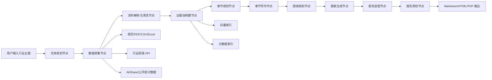
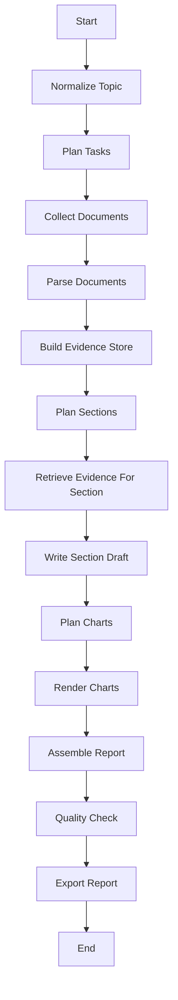

# 多模态行业研报生成 Agent 系统设计文档

## 1. 文档目标

本文档面向一个"容易实现、能够跑通、同时具备一定技术含金量"的多模态行业研报生成 Agent 系统。

系统目标是:

- 输入一个行业主题，例如“人形机器人”“算力租赁”“低空经济”
- 自动完成行业资料收集、结构化数据整理、章节分析、图表生成、报告装配
- 输出一份图文并茂、结构清晰、可追溯的数据型行业研究报告

本文档设计继承“任务拆解 + 数据块检索 + 分章节写作 + 图表增强”的核心思路，但重构为更适合工程落地的系统形态。

---

## 2. 设计原则

### 2.1 核心原则

1. 先跑通，再增强
2. 先保证可控，再提升智能性
3. 先结构化事实，再生成结论
4. 图表必须由数据驱动，不依赖模型幻想
5. 每一段结论尽量能回溯到来源

### 2.2 设计取舍

本系统不追求第一版就做成完全开放式通用研究 Agent，而是聚焦“行业研报生成”这一高价值垂类任务。

因此第一版做以下取舍:

- 采用 `LangGraph` 作为主编排层，不直接上 Deep Agents
- 使用“固定阶段工作流”而非完全自由探索
- 数据接入优先接入最容易拿到、最稳定的公开源
- 图表生成优先用确定性 Python 绘图，不把 HTML 可视化生成作为主链路
- 报告输出优先 Markdown + HTML/PDF，减少复杂排版依赖

这样可以显著降低工程复杂度，同时保留后续扩展空间。

---

## 3. 系统目标与边界

### 3.1 功能目标

- 支持行业主题输入
- 支持自动检索行业研究资料
- 支持抓取网页、PDF、表格类数据
- 支持抽取结构化事实与关键指标
- 支持章节级写作
- 支持自动生成折线图、柱状图、饼图、对比表
- 支持输出最终研报

### 3.2 非目标

- 第一版不做实时行情交易决策
- 第一版不做复杂多用户协作编辑
- 第一版不做全自动财务建模平台
- 第一版不做毫秒级响应

### 3.3 成功标准

- 单个行业主题可以在 5 到 15 分钟内稳定生成一份完整报告
- 报告包含不少于 4 个一级章节
- 报告包含不少于 3 张图或表
- 报告中的核心数据和文字结论可追溯到原始资料
- 流程失败时可以明确停在某个阶段并重试

---

## 4. 技术选型

### 4.1 编排层选型

推荐选型: `LangGraph`

原因:

- 任务天然是多阶段状态流转
- 每个阶段都有明确输入输出
- 需要失败重试、条件分支、人工复核插点
- 比完全自由 Agent 更容易控成本、控质量、控时延

不推荐第一版直接使用 Deep Agents 作为主框架，原因不是能力不够，而是会引入过多开放式能力，增加系统不确定性。这个项目的首要目标是稳定产出行业报告，而不是做一个全能助手。

### 4.2 模型层选型

建议采用双模型配置:

- `Planner / Writer Model`
  - 用于任务拆解、章节写作、总结润色
  - 要求长文本能力稳定、指令遵循强
- `Fast Utility Model`
  - 用于路由、分类、数据块筛选、图表规格生成
  - 要求成本低、响应快

可选附加模型:

- `Vision Model`
  - 用于图表截图质检
  - 属于增强链路，不作为主链路依赖

### 4.3 数据层选型

建议采用分层数据策略:

- 公开网页与研报内容
- 结构化行业/公司数据
- 本地中间产物缓存
- 向量检索索引

### 4.4 输出层选型

- 中间产物: JSON + Markdown
- 最终产物: Markdown / HTML / PDF

---

## 5. 总体架构



---

## 6. 系统模块设计

## 6.1 Query Planner

职责:

- 将用户输入的行业主题重写为可研究任务
- 生成标准化研究提纲
- 约束报告范围与时间窗口

输入:

- 行业主题
- 可选时间范围
- 可选报告风格

输出:

- `normalized_topic`
- `report_scope`
- `task_list`
- `expected_sections`

建议输出示例:

```json
{
  "normalized_topic": "中国人形机器人行业研究（截至 2026 年）",
  "task_list": [
    "界定行业范围与产业链结构",
    "评估市场规模与增长阶段",
    "分析竞争格局与代表企业",
    "分析政策、技术与资本驱动因素",
    "输出未来 3 年情景判断与投资风险"
  ]
}
```

---

## 6.2 Data Connector Layer

该层是系统最关键的工程资产，必须做成可替换的数据适配器。

建议拆成四类 Connector:

### A. 行业研究内容 Connector

来源:

- 东方财富行业研报列表与详情页
- 券商公开网页研报
- 行业资讯网页

借鉴点:

东方财富行业研报抓取链路已经验证可用。

### B. 结构化市场数据 Connector

来源:

- AkShare
- 国家统计局
- 行业协会公开数据
- 政策公告网站

### C. 公司画像 Connector

来源:

- 同花顺基础资料页
- AkShare 公司/股票接口
- 年报与公告

### D. 文档型资料 Connector

支持:

- HTML
- PDF
- CSV
- Excel
- TXT

### Connector 接口建议

```python
class SourceConnector(Protocol):
    def search(self, topic: str, **kwargs) -> list[dict]: ...
    def fetch(self, item_id: str | None = None, url: str | None = None) -> dict: ...
    def normalize(self, raw: dict) -> dict: ...
```

这样后续扩充数据源时不需要改主流程。

---

## 6.3 Document Parsing Layer

职责:

- 把网页、PDF、表格文件统一解析成可消费文本
- 抽取标题、日期、来源、正文、表格、链接
- 产出统一文档对象

统一文档对象建议如下:

```json
{
  "doc_id": "uuid",
  "source_type": "industry_report",
  "source_name": "eastmoney",
  "title": "人形机器人行业深度报告",
  "published_at": "2026-03-20",
  "url": "https://...",
  "content_markdown": "...",
  "content_text": "...",
  "attachments": [],
  "meta": {
    "org_name": "某券商",
    "topic_tags": ["人形机器人", "制造业"]
  }
}
```

设计建议:

- HTML 用网页清洗器转 Markdown
- PDF 用 PDF 转 Markdown 方案
- 表格文件转 DataFrame 再转 Markdown
- 保留原始链接和发布日期

---

## 6.4 Evidence Store

职责:

- 管理“证据池”
- 统一存储结构化数据、文档块、图表数据候选
- 支持检索和引用

建议分两层:

### 事实层

- 行业规模
- 增长率
- 公司指标
- 政策发布时间
- 渠道与市场份额

### 语义层

- 研报正文
- 网页文章
- PDF 段落
- 会议纪要

建议存储结构:

- 原始文档: SQLite / Postgres
- 中间对象: JSON 文件
- 向量索引: Chroma / FAISS

Chunk 设计建议:

- 每个 chunk 控制在 500 到 1200 中文字
- 强制绑定 `title`、`source`、`date`、`url`
- 表格类 chunk 单独建模，不和长文本混在一起

---

## 6.5 Retrieval & Citation Layer

职责:

- 为每个章节子任务选择最相关证据
- 给生成模型提供可引用上下文
- 把结论和来源绑在一起

推荐检索策略:

1. 元数据过滤
2. BM25 粗召回
3. 向量检索精排
4. 小模型 rerank

为什么这样设计:

- 单用向量检索容易被行业术语带偏
- 单用关键词检索召回不稳
- 混合检索更适合行业报告场景

引用对象建议:

```json
{
  "citation_id": "c12",
  "doc_id": "d88",
  "title": "2026 人形机器人产业链研究",
  "published_at": "2026-03-12",
  "source_name": "eastmoney",
  "url": "https://...",
  "chunk_text": "..."
}
```

---

## 6.6 Section Writer

职责:

- 基于任务和证据写出章节内容
- 保证章节级逻辑清晰
- 输出中间 Markdown

推荐采用“章节级生成”而不是整篇一次性生成。

原因:

- 更容易控幻觉
- 更方便重试
- 更方便插图表
- 更适合引用管理

章节写作建议流程:

1. 输入章节目标
2. 输入该章节检索到的证据
3. 输出章节草稿
4. 单独做事实核对
5. 再做润色

章节输出结构建议:

- 章节标题
- 核心观点
- 数据支撑
- 风险与限制
- 可视化建议

---

## 6.7 Chart Planner

这是系统的“含金量模块”之一。

职责:

- 从章节草稿中识别哪些内容适合图表化
- 生成图表规格，而不是直接让模型乱画

推荐不要把图表生成设计成“模型直接输出 HTML 图表代码”为主链路。

更推荐:

1. 模型先输出 `chart_spec`
2. 后端根据 `chart_spec` 用 Python 确定性绘图

建议图表规格:

```json
{
  "chart_type": "bar",
  "title": "2024-2026E 人形机器人市场规模",
  "x": ["2024", "2025E", "2026E"],
  "y": [120, 210, 360],
  "unit": "亿元",
  "caption": "市场规模持续上行，2026E 增速显著提升",
  "source_refs": ["c12", "c18"]
}
```

支持图表类型:

- 折线图
- 柱状图
- 堆叠柱状图
- 饼图
- 对比表
- 时间轴

---

## 6.8 Chart Renderer

职责:

- 根据 `chart_spec` 渲染高质量图片
- 统一风格
- 输出可嵌入报告的图片文件

建议实现:

- Python + Matplotlib / Plotly
- 保存 PNG 和 SVG

统一风格约束:

- 中文字体统一
- 标题、图例、单位样式统一
- 所有图下方自动附来源摘要

视觉质检建议:

- 第一版可不依赖 VLM
- 第二版加入 Vision Model 做截图验收
- Vision 仅做“是否清晰、是否遮挡、标题是否存在”的检查

---

## 6.9 Report Assembler

职责:

- 将章节文本、图表、表格、引用合并成完整研报

建议输出模板:

1. 扉页
2. 摘要
3. 行业概况
4. 市场规模与阶段
5. 竞争格局
6. 政策与技术驱动
7. 情景预测
8. 风险提示
9. 结论
10. 参考资料

装配时需要做到:

- 自动插入图表
- 自动编号图 1、图 2、表 1、表 2
- 自动生成参考资料列表

---

## 6.10 Quality Gate

职责:

- 在最终输出前做自动质检

建议至少做 5 类检查:

1. 结构完整性检查
2. 数据引用检查
3. 图表文件存在性检查
4. 重复结论与空话检查
5. 时间一致性检查

建议对每个章节输出如下质量状态:

```json
{
  "section": "竞争格局",
  "status": "pass",
  "issues": []
}
```

---

## 7. LangGraph 工作流设计

推荐图结构如下:



状态对象建议:

```python
class ReportState(TypedDict):
    user_query: str
    normalized_topic: str
    task_list: list[str]
    documents: list[dict]
    evidence_chunks: list[dict]
    section_plans: list[dict]
    drafted_sections: list[dict]
    chart_specs: list[dict]
    chart_assets: list[dict]
    final_report_md: str
    qc_result: dict
```

---

## 8. 数据源设计建议

## 8.1 第一优先级数据源

- 东方财富行业研报
- AkShare 行业/公司公开数据
- 国家统计局
- 工信部、发改委、证监会等政策站点
- 龙头公司财报与年报

原因:

- 容易接入
- 中文行业研究场景友好
- 足够支持第一版出报告

## 8.2 第二优先级数据源

- 行业协会报告
- 券商 PDF 研报全文
- 新闻站点
- 学术论文

## 8.3 数据接入策略

- 列表类接口优先直接 API
- 文档类优先抓详情页和 PDF
- 表格类优先落标准化 DataFrame

---

## 9. 存储设计

推荐采用轻量可跑通方案:

### 9.1 本地目录结构

```text
data/
  raw/
  parsed/
  evidence/
  charts/
  reports/
cache/
  embeddings/
db/
  app.db
```

### 9.2 SQLite 表设计

建议至少包含:

- `documents`
- `chunks`
- `runs`
- `charts`
- `reports`

这样第一版就能支持:

- 查询历史运行
- 重用已抓取文档
- 避免重复向量化

---

## 10. API 设计

如果需要做成服务化，推荐以下接口:

### POST `/api/report/run`

创建一次研报生成任务

### GET `/api/report/{run_id}`

查看任务状态

### GET `/api/report/{run_id}/markdown`

下载 Markdown

### GET `/api/report/{run_id}/html`

下载 HTML

### GET `/api/report/{run_id}/pdf`

下载 PDF

### GET `/api/report/{run_id}/artifacts`

查看图表、原始证据和日志

---

## 11. MVP 落地方案

## 11.1 第一版必须做的能力

- 输入行业主题
- 抓行业研报列表与正文
- 抓 3 到 5 个代表公司基础数据
- 建证据池
- 生成 4 到 6 个章节
- 自动生成 3 张图表
- 输出 Markdown 和 PDF

## 11.2 第一版可以不做的能力

- 多模型自动博弈
- HTML 图表自动生成再 VLM 修正
- 全自动网页 DFS 深爬
- 复杂多轮人机共创

## 11.3 第一版建议技术栈

- Orchestration: LangGraph
- LLM SDK: LangChain
- Parsing: 自定义 + PDF 转 Markdown
- Data: AkShare + requests + BeautifulSoup
- Retrieval: BM25 + Chroma
- Rendering: Matplotlib
- Export: Markdown + HTML + Playwright PDF
- Storage: SQLite + 本地文件

---

## 12. 第二阶段增强方向

当第一版稳定后，再加以下能力:

### 12.1 搜索增强

- 支持外部搜索
- 支持网页多跳跟进
- 支持 PDF 自动下载与解析

### 12.2 图表增强

- 图表规格自动审查
- Vision 质检
- 主题风格模板

### 12.3 分析增强

- 数据分析代码执行沙箱
- 同比、环比、CAGR、敏感性分析自动计算
- 行业情景模拟模块

### 12.4 可信性增强

- 段落级 citation
- 事实一致性校验
- 高风险结论人工复核

---

## 13. 风险与规避策略

### 风险 1: 数据源不稳定

问题:

- 页面结构变化
- 反爬
- URL 失效

策略:

- 数据接入层 adapter 化
- 列表页与详情页分开缓存
- 关键源设置备用源

### 风险 2: 幻觉与错误结论

问题:

- 模型会补齐不存在的数据

策略:

- 章节级只喂证据池
- 没证据不允许给确定结论
- 强制输出引用

### 风险 3: 图表好看但不可信

问题:

- 模型生成图表代码容易偏离数据

策略:

- 图表由结构化数据直接渲染
- 图表规格单独建模

### 风险 4: 成本过高

问题:

- 长文档 + 多章节 + 多轮生成

策略:

- chunk 化
- 缓存 embeddings
- 小模型负责路由与筛选
- 大模型只负责真正写作

---

## 14. 推荐实施顺序

### Phase 1

- 搭建 LangGraph 主流程
- 接入东方财富行业研报
- 接入 AkShare 基础数据
- 输出 Markdown 报告

### Phase 2

- 接入 PDF 解析
- 接入向量检索
- 加图表渲染
- 输出 PDF

### Phase 3

- 加外部搜索
- 加代码执行分析
- 加 Vision 质检
- 加人工复核节点

---

## 15. 最终推荐方案

如果目标是“3 到 6 周内做出一个能演示、能产出、能继续扩展的多模态行业研报 Agent”，推荐最终方案如下:

- 主框架用 `LangGraph`
- 数据层采用“行业研报 + 结构化行业数据 + 代表公司数据”三层组合
- 报告生成采用“子任务拆解 -> 章节检索 -> 章节写作 -> 图表规划 -> 图表渲染 -> 报告装配”闭环
- 图表主链路采用“结构化规格 + Python 渲染”
- 报告输出采用 Markdown/HTML/PDF 三格式

这是一个非常适合先做成产品原型，再逐步增强为专业研究助手的路线。

它比比赛式 Notebook 原型更稳，比全开放式 Agent 更可控，也比单纯 RAG 问答更有产品价值。

---

## 16. 一句话总结

这套系统最重要的不是“让模型更自由”，而是“让数据、流程、写作、图表形成一个可控闭环”。

闭环一旦跑通，这个项目就不仅能生成报告，还能逐步升级成真正的研究生产系统。
